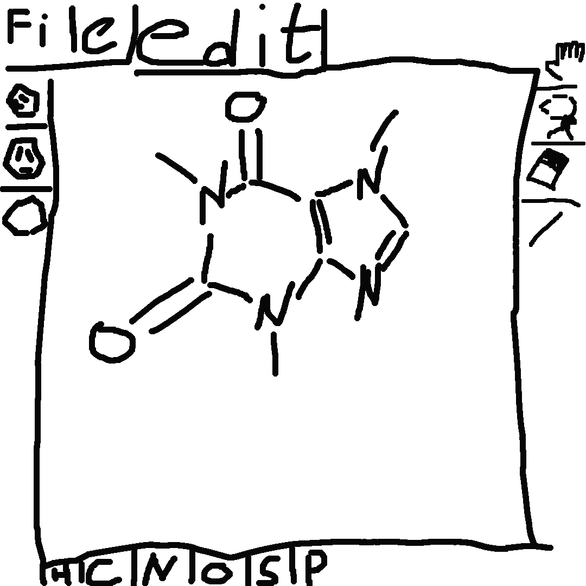
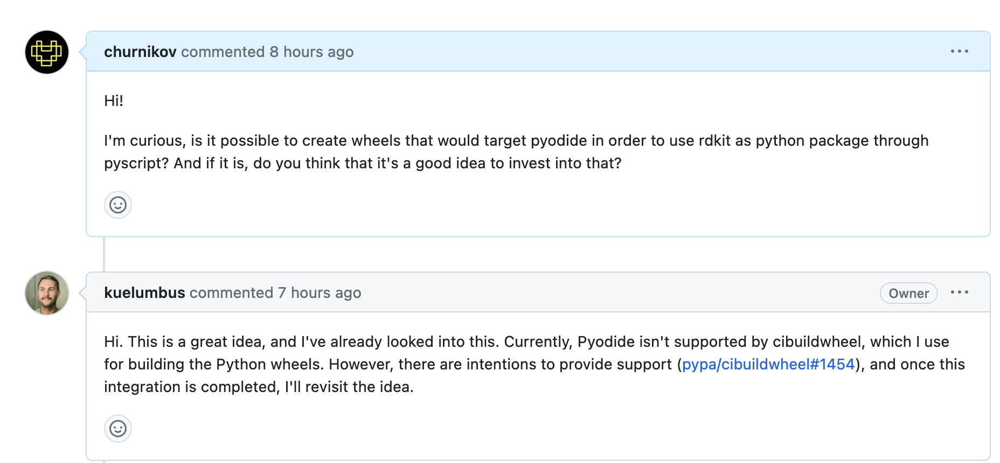
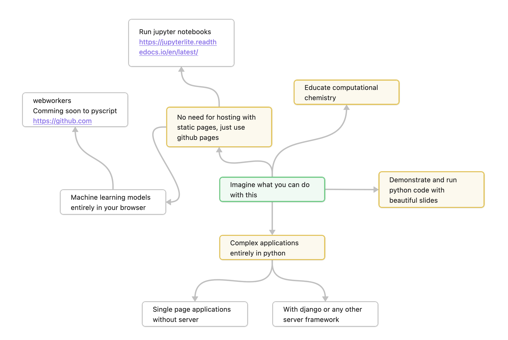

## Build Drug Discovery web applications with PyScript, Ketcher and rdkit

While people are coming, how are you doing?

</img>

Or go to the URL [menti.com](www.menti.com) and enter **3563 2552**

Notes:

Hello everyone, my name is Nikita and today I'm going to talk about how to build drug discovery web applications with PyScript, Ketcher and rdkit.

---

<div style='position: relative; padding-bottom: 56.25%; padding-top: 35px; height: 0; overflow: hidden;'><iframe sandbox='allow-scripts allow-same-origin allow-presentation' allowfullscreen='true' allowtransparency='true' frameborder='0' height='315' src='https://www.mentimeter.com/app/presentation/aljempc8cj61smhmwvpr4pycfpqbvvwy/embed' style='position: absolute; top: 0; left: 0; width: 100%; height: 100%;' width='420'></iframe></div>

---

# `$ WhoAmI`

- Name: Nikita 
- @churnikov
- Software Engineer @ SciLifeLab

Note: I go on the internet under @churnikov and I'm currently working as a software engineer at SciLifeLab.

---

<div class="container">
    <div class="col">
        <div class="r-stack">
            <p class="fragment">Some kind of molecule input</p>
        </div>
    </div>
    <div class="col">
        <div class="fragment">
            <button class=>Get all QSAR properties</button>
            <button>Run retrosythesys</button>
            <button>Is it a good drug?</button>
        </div>
    </div>
</div>

Note:
Let's say we want to build the following app, where we have some kind of molecule input and we want to get all QSAR properties, run retrosythesys and check if it is a good drug.

----
# Setup

<p class="fragment">You are computational chemist</p>
<p class="fragment">You know python and some html</p>
<p class="fragment">You would likely use ChatGPT to work with JavaScript, CSS and HTML</p>

Note:
But our computational chemist is not a web developer. He knows python and some html. So he would likely use ChatGPT to work with JavaScript, CSS and HTML.

But may be let him use chat gpt for css and html only? And use his/her knowledge of python?

----

# What options do you have?

----

- Dash <i class="fa-solid fa-server fragment strikediag" data-fragment-index="1"></i> <i class="fragment fa-solid fa-screwdriver-wrench" data-fragment-index="1"></i> <a class="fragment" data-fragment-index="1" href="https://github.com/ibdafna/webdash">webdash</a>
- Streamlit <i class="fa-solid fa-server fragment strikediag" data-fragment-index="1"></i> <i class="fragment fa-solid fa-screwdriver-wrench" data-fragment-index="1"></i> <a class="fragment" data-fragment-index="1" href="https://github.com/whitphx/stlite">stlite</a>
- Gradio
- Mercury
- Panel <i class="fa-solid fa-server fragment strikediag" data-fragment-index="1"></i>
- PyScript may be? <i class="fa-solid fa-server fragment strikediag" data-fragment-index="2"></i>

Note:
All of them might be good options. But all of them require a dedicated server. And you need to know how to deploy them.

But that is as well rapidly changing with 

But in my opinion, PyScript is great, because you can build with not too much effort
applications that 

---

# How to input molecules?

----

<ul>
    <li> 
        Use SMILES!
        <br> Input: <input type="text" class="inline-input" style="width: 15em;font-size:0.5em;font-family: 'Roboto Mono', monospace;" value="Cn1cnc2n(C)c(=O)n(C)c(=O)c12" />
    </li>
    <li class="fragment">
        Draw them!<br>
        </img>
    </li>
</ul>

---

# How to draw molecules?

----

<!-- - [Streamlit Ketcher](https://blog.streamlit.io/introducing-a-chemical-molecule-component-for-your-streamlit-apps/) -->
- [MarvinJS](https://chemaxon.com/marvin) <span class="fragment">Pretty but, free non commercially</span>
- [JSME](https://jsme-editor.github.io) <span class="fragment">Free, but not very pretty</span>
- [ChemWriter](https://chemwriter.com/) <span class="fragment">Not very pretty, free non commercially</span>
- [Ketcher](https://lifescience.opensource.epam.com/ketcher/index.html) <span class="fragment">Free, open source, pretty</span>
<p class="fragment">Worth checking out as alternative to the whole talk <a href="https://github.com/mik-laj/streamlit-ketcher">streamlit-ketcher</a></p>
<p class="fragment">
Short answer, no. For now at least. <a href="https://gist.github.com/churnikov/2d5001428c8a7d7ddc40429b9b4e2c58">Checkout this gist</a>

<div class="fragment">
    <p>
        Demos for all of them bellow
    </p>
    <p>
        <button class="btn"><i style="font-size: 3em" class="fa-solid fa-arrow-down navigate-down"></i></button>
    </p>
</div>

Note: I'm not going to go into details about all of them.

----

# Try them out

----

# JSME

<iframe src="https://jsme-editor.github.io/dist/JSME_test.html" width="100%" height="600"></iframe>

----

# MarvinJS
<a href="https://marvinjs-demo.chemaxon.com/latest/demo.html">https://marvinjs-demo.chemaxon.com/latest/demo.html</a>

> Cannot be embedded
----
# Ketcher

<iframe src="https://churnikov.github.io/demo/pyketch/ketcher/index.html" width="100%" height="500"></iframe>

----

# ChemWriter

<div id="editor"
    data-chemwriter-width="100%" data-chemwriter-height="500"
    data-chemwriter-ui="editor"
    data-chemwriter-src="https://chemwriter.com/data/structure-1.mol">
</div>

---

## Adding Ketcher to your page

[Download it standalone](https://github.com/epam/ketcher/releases/tag/v2.12.0)

```bash[|8]
ketcher/
├── apple-touch-icon.png
├── asset-manifest.json
├── favicon-16x16.png
├── favicon-32x32.png
├── favicon.ico
├── iframe.html
├── index.html
├── logo.svg
├── manifest.json
├── robots.txt
├── static
└── templates
```

----

```HTML
<iframe id="ketcher-demo" src="ketcher/index.html" width="100%" height="500px"></iframe>
```

<iframe src="assets/ketcher/index.html" width="100%" height="400px"></iframe>

----

Add it to your folder with `index.html`

```bash
ketcher/
├── ...
├── index.html # Index page for Ketcher
index.html # your main page. Here you add iframe
```

----

<iframe id="ketcher-demo" src="assets/ketcher/index.html" width="100%" height="500px"></iframe>

<div class="container">
    <div class="col">
        <p>
        <input id="5-copy-molecule-field" type="text" placeholder="Type your molecule" value="CN1C=NC2=C1C(=O)N(C(=O)N2C)C">
        <button label="Set molecule" py-click="set_mol('ketcher-demo', get_molecule_from_input('5-copy-molecule-field'))">Set molecule</button>
        </p>
        <p>
        <input id="5-copy-reaction-field" type="text" placeholder="Type your reaction" value="CC(=O)O.OCC>>CC(=O)OCC">
        <button label="Set reaction" py-click="set_mol('ketcher-demo', get_molecule_from_input('5-copy-reaction-field'))">Set reaction</button>
        </p>
    </div>
    <div class="col">
        <p>
            <button py-click="import asyncio; asyncio.create_task(set_molecule_in_div())" id="5-get-molecule">Get from Ketcher</button>
        </p>
        <p>
            <div style="font-family: mono" id="5-molecule-div"></div>
        </p>
    <div>
</div>
Note: Draw some molecules and stuff

---

### Done with PyScript

#### <button label="Set molecule" py-click="set_mol('ketcher-demo', mol:=get_molecule_from_input('5-copy-molecule-field')); display(f'Set molecule on previous slide {mol}', target='set-molecule-log')">Set molecule</button>

```html
<input id="5-copy-molecule-field" type="text" placeholder="Type your molecule" value="CN1C=NC2=C1C(=O)N(C(=O)N2C)C">
<button label="Set molecule" py-click="set_mol('ketcher-demo', get_molecule_from_input('5-copy-molecule-field'))">Set molecule</button>
```

```python
import js


def set_mol(ketcher_window_id, smiles):
    ketcher = js.document.getElementById(ketcher_window_id).contentWindow.ketcher
    ketcher.setMolecule(smiles)

def get_molecule_from_input(input_id):
    input = js.document.getElementById(input_id)
    return input.value
```

<pre class="overflow-y-scroll h-60" id="set-molecule-log"></pre>

----

### <button py-click="import asyncio; asyncio.create_task(set_molecule_in_div()); display('Got molecule on previons slide', target='get-molecule-log')" id="5-get-molecule">Get from Ketcher</button>

```html
<button py-click="import asyncio; asyncio.create_task(set_molecule_in_div())" id="5-get-molecule">Get from Ketcher</button>
```

```python
async def get_molecule_from_ketcher(ketcher_window_id):
    ketcher = js.document.getElementById(ketcher_window_id).contentWindow.ketcher
    return await ketcher.getSmiles()

async def set_molecule_in_div():
    mol = await get_molecule_from_ketcher('ketcher-demo')
    js.document.getElementById('5-molecule-div').innerHTML = mol
```

<pre class="overflow-y-scroll h-60" id="get-molecule-log"></pre>
---

# PyScript

Python in the browser

Note: Now we need to interact with this window somehow. Again, we are not doing JavaScript, so we need to find a way to do it from python. Fortunately, there is PyScript.

----

[pyscript.net](https://pyscript.net/)

<iframe src="https://pyscript.net/" width="100%" height="600"></iframe>

----

- Something **standard** could be done via **PyScript**
- Something **custom** could be done via **Pyodide**

----
Let's add it to the presentation
```html
<head>
  <link rel="stylesheet" href="https://pyscript.net/latest/pyscript.css" />
  <script defer src="https://pyscript.net/latest/pyscript.js"></script>
</head>
<body>
  <py-repl>1+1+1</py-repl>
</body>
```

<py-repl class="fs-30">1+1+1</py-repl>

<py-repl class="fs-30"> 
import random
random.randint(1, 100)
</py-repl>
----

We can also make PyScript interact with the presentation

<div>
    <button id="say-hi-button">Click Me!</button>
    <div class="info-icon">
        <i class="fa-solid fa-code fa-lg"></i>
        <div style="width: 600px" class="tooltip">
            <div class="code-snippet">
                <pre style="all: initial; font-size: 20px">
                <code>
<button id="say-hi-button">Click Me!</button>
                </code>
            </div>
        </div>
    </div>
</div>

```html
<py-script>
from pyscript import when, display

@when("click", selector="#say-hi-button")
def say_hi(event):
    display(f"Hi from pyscript!", target="say-hi-log")
    display(f"Triggered by {event}", target="say-hi-log")
</py-script>
```
<py-script src="assets/pyscripts/demo.py"></py-script>

<div> 
<pre class="overflow-y-scroll h-60 " id="say-hi-log"></pre>
    <div class="info-icon">
        <i class="fa-solid fa-code fa-lg"></i>
        <div style="width: 800px" class="tooltip">
            <div class="code-snippet">
                <pre style="all: initial; font-size: 20px">
                <code>
<pre class="overflow-y-scroll h-60" id="say-hi-log"></pre>
                </code>
            </div>
        </div>
    </div>

</div>

---

<!-- Back to ketcher -->

<!-- ---- -->

<!-- <iframe src="ketcher-developers-manual.html" width=100% height=600></iframe> -->

<!-- --- -->

<!-- <section data-background-iframe="https://churnikov.github.io/demo/pyketch/index.html" data-background-interactive> -->
<!-- <div class="container"> -->
<!-- <div class="col"> -->
<!-- </div> -->
<!-- <div class="col"> -->
<!-- <div class="r-stack"> -->
<!--  <iframe src="ketcher-developers-manual.html#installation" width=100% height=600></iframe> -->
<!--  <iframe class="fragment" src="ketcher-developers-manual.html#access-ketcher" width=100% height=600></iframe> -->
<!--  <iframe class="fragment" src="ketcher-developers-manual.html#set-smiles" width=100% height=600></iframe> -->
<!--  <iframe class="fragment" src="https://www.npmjs.com/package/@rdkit/rdkit#user-content-running-rdkitjs-in-your-javascript-code" width=100% height=600></iframe> -->
<!-- </div> -->
<!-- </div> -->
<!-- </div> -->
<!-- </section> -->

<!-- --- -->

Let's do something with molecules

<p class="fragment">
Just <span class="inline-code"> pip install rdkit</span><span class="fragment">?</span></p>

<p class="fragment">Welll...</p>

Note: 
Now that we are able to get molecules by drawing them and get them into python, the only thing left is to actually do
something with them. 

So PyScript offers ability to add some python packages to the browser.

----

### 1. Python packages are added via config

```html[3-5|6-17]
<head>
...
<!-- "Installation" of PyScript -->
<script defer src="https://pyscript.net/latest/pyscript.js"></script>
<link rel="stylesheet" type="text/css" href="https://pyscript.net/latest/pyscript.css" />
<!-- Configuration of PyScript -->
<py-config type="toml">
    packages = ["numpy", "matplotlib"]

    [splashscreen]
    autoclose = true

    [[interpreters]]
    src = "https://cdn.jsdelivr.net/pyodide/v0.23.4/full/pyodide.js"
    name = "pyodide-0.23.4"
    lang = "python"
</py-config>
```

[https://docs.pyscript.net/latest/reference/elements/py-config.html](https://docs.pyscript.net/latest/reference/elements/py-config.html)

[https://pyodide.org/en/stable/usage/packages-in-pyodide.html](https://pyodide.org/en/stable/usage/packages-in-pyodide.html)

----

<iframe src="assets/demos/numpy_plot_demo.html" width="70%" height="600"></iframe>

[https://matplotlib.org/stable/plot_types/basic/plot.html#sphx-glr-plot-types-basic-plot-py](https://matplotlib.org/stable/plot_types/basic/plot.html#sphx-glr-plot-types-basic-plot-py)

----

Let's add rdkit then

```toml
<py-config type="toml">
    ....
    packages = ["rdkit"]
    ....
```

----

<iframe src="assets/demos/add_pypi_rdkit_package.html" width="100%" height="600"></iframe>

----

About packages..

<div class="fragment">Two types of packages</div>

<div class="container">
    <div class="col fragment">
      <p> Pure python packages</p>
      <p> In other words, look like this: </p>
      <p> <span class="inline-code">pack-ver-py3-none-any.whl</span></p>
    </div>
    <div class="col fragment">
      <p> Packages build specifically for Pyodide</p>
      <p>
        <a href=https://pyodide.org/en/stable/usage/packages-in-pyodide.html>
            https://pyodide.org/en/stable/usage/packages-in-pyodide.html
        </a>
    </p>
    </div>
</div>
----



---


So.. no hope?

<p class="fragment">Meanwhile use <a href="https://www.rdkitjs.com/">rdkit.js</a></p>
----

Setup


```html[6-12]
<head>
...
<!-- "Installation" of PyScript -->
<script defer src="https://pyscript.net/latest/pyscript.js"></script>
<link rel="stylesheet" type="text/css" href="https://pyscript.net/latest/pyscript.css" />
<script src="https://unpkg.com/@rdkit/rdkit/dist/RDKit_minimal.js"></script>
<script>
initRDKitModule().then(function (instance) {
  RDKitModule = instance;
  console.log("version: " + RDKitModule.version());
});
</script>
```
----
<p>
<div>
    <button id="rdkitjs-demo-button" py-click="set_mol('rdkitjs-demo', 'CN1C=NC2=C1C(=O)N(C(=O)N2C)C')">Set molecule</button>
    <div class="info-icon">
        <i class="fa-solid fa-code fa-lg"></i>
        <div style="width: 1200px" class="tooltip">
            <div class="code-snippet">
                <pre style="all: initial; font-size: 18px">
                <code>
<button id="rdkitjs-demo-button" py-click="set_mol('rdkitjs-demo', 'CN1C=NC2=C1C(=O)N(C(=O)N2C)C')">Set molecule</button>
                </code>
            </div>
        </div>
    </div>
</div>
</p>

<iframe id="rdkitjs-demo" src="assets/ketcher/index.html" width="60%" height="400px">
</iframe>

<py-repl class="fs-30">
import asyncio
smiles_task = asyncio.create_task(get_molecule_from_ketcher('rdkitjs-demo'))
</py-repl>

----

<py-repl class="fs-30">
mol = smiles_task.result()
mol
</py-repl>

<py-repl class="fs-30">
import js
mol = js.RDKitModule.get_mol(mol)
mol
</py-repl>

Some demos converted from [rdkitjs.com](https://www.rdkitjs.com/)

<button class="btn"><i style="font-size: 3em" class="fa-solid fa-arrow-down navigate-down"></i></button>

----

<div class="container">
    <div class="col fs-20" style="width: 50%">
        <py-repl>
        import asyncio
        smiles_task = asyncio.create_task(get_molecule_from_ketcher('rdkitjs-demo'))
        </py-repl>
        <py-repl>
        import js
        smiles = smiles_task.result() or "CC(=O)Oc1ccccc1C(=O)O"
        mol = js.RDKitModule.get_mol(smiles)
        dest = js.document.getElementById(
            "rdkitjs-example-output-1"
        )
        svg = mol.get_svg()
        dest.innerHTML = svg
        </py-repl>
    </div>
    <div class="col">
        <div id="rdkitjs-example-output-1"></div>
    </div>
</div>


----

[https://www.rdkitjs.com/#descriptors-calculation](https://www.rdkitjs.com/#descriptors-calculation)

<div class="container">
    <div class="col" style="font-size: 20px; width: 50%">
        <py-repl>
import asyncio
smiles_task = asyncio.create_task(
    get_molecule_from_ketcher('rdkitjs-demo')
)
        </py-repl>
        <py-repl>
import js
import json
smiles = smiles_task.result() or "CC(=O)Oc1ccccc1C(=O)O"
mol = js.RDKitModule.get_mol(smiles)
descriptors = json.loads(mol.get_descriptors())
res_str = "\n".join(
    f"{key}: {value}" 
    for (key, value) 
    in descriptors.items()
)
display(res_str, target="rdkitjs-example-output-7")
        </py-repl>
    </div>
    <div class="col">
        <pre class="overflow-y-scroll h-400" style="font-size: 14px" id="rdkitjs-example-output-7"></pre>
    </div>
</div>

---

</img>


Note: but there is so much more you can do. Show some of the stuff that I've done

---

# Downsides of PyScript

1. Heavily depends on the internet <i class="fa-solid fa-arrow-right"></i> Might be slow to load
2. Still in development <i class="fa-solid fa-arrow-right"></i> bugs, rapid api changes
3. Early adoption <i class="fa-solid fa-arrow-right"></i> Is not friends yet with some tools established (i.e. VUE)

<!-- --- -->

<!-- # Takeaways -->

<!-- - PyScript -- teaches you frontend development -->
<!-- - No need for dedicated server with st -->

<!-- Note: -->

<!-- Developer perspective -->
<!-- - PyScript is great if you want to try frontend development but you only know python -->
<!-- - You also don't need a backend for some fairly complex applications -->

<!-- Teacher perspective -->
<!-- - PyScript can let you build some cool interactive applications around python. -->
<!-- - Tools are easy to use, and pretty powerful at the same time. -->

<!-- If there is no python package that you can use, there is probably js package or build an api for this -->

---

Maybe PyScript is not ready for production yet.

But it will help you make friends with Browser.

Note:
I will certainly teach to work with browser tools and not be afraid of them.

---

<div style="font-size:18px">

# Resources

Software to draw molecules
- [Ketcher](https://lifescience.opensource.epam.com/ketcher/index.html) and [Streamlit ketcher](https://blog.streamlit.io/introducing-a-chemical-molecule-component-for-your-streamlit-apps/) and [stlite](https://github.com/whitphx/stlite)
- [MarvinJS](https://chemaxon.com/marvin) and [Marvin Dash](https://github.com/stsouko/marvin_dash)

PyScript
- [PyCon US 2023 PyScript slides](https://jeff.glass/post/pycon23-slides/)
- [How to interact with a backend with PyScript](https://docs.pyscript.net/latest/tutorials/requests.html)
- [PyScript - what you need to know by Nicholas H. Tollervey](https://www.youtube.com/watch?v=ocpVSExSDvw&t=3s&pp=ygUVTmljaG9sYXMgSC4gVG9sbGVydmV5)
- [Build a webapp with Flask and PyScript](https://www.youtube.com/watch?v=WZRNbspsjFM)
- [Build a webapp with Django and PyScript](https://www.youtube.com/watch?v=zw4V48Al8LU)
- [How to secure your api](https://medium.com/swlh/3-ways-to-secure-your-web-api-for-different-situations-8d5cd4762ab3)
- [PyScript: A Useful Abomination?](https://medium.com/analytics-vidhya/pyscript-a-useful-abomination-adc1f550c4be)

Chemical toolkit that works in browser
- [Rdkit JS](https://www.rdkitjs.com/)
- [chpython](https://github.com/chython/chython)

Slides
- [This talk in by blog](TODO)
- [reveal-md](https://github.com/webpro/reveal-md) and [reveal-js](revealjs.com/)

